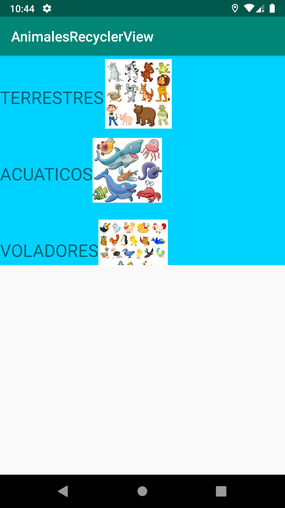
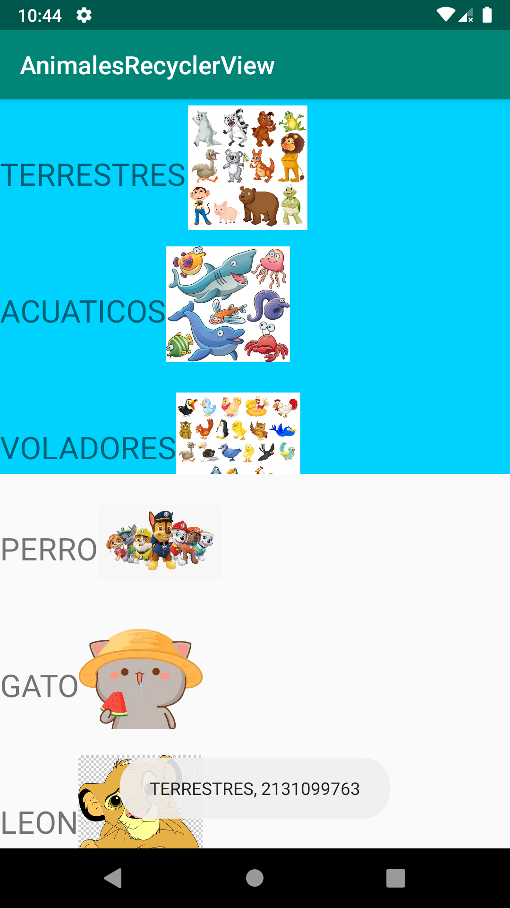
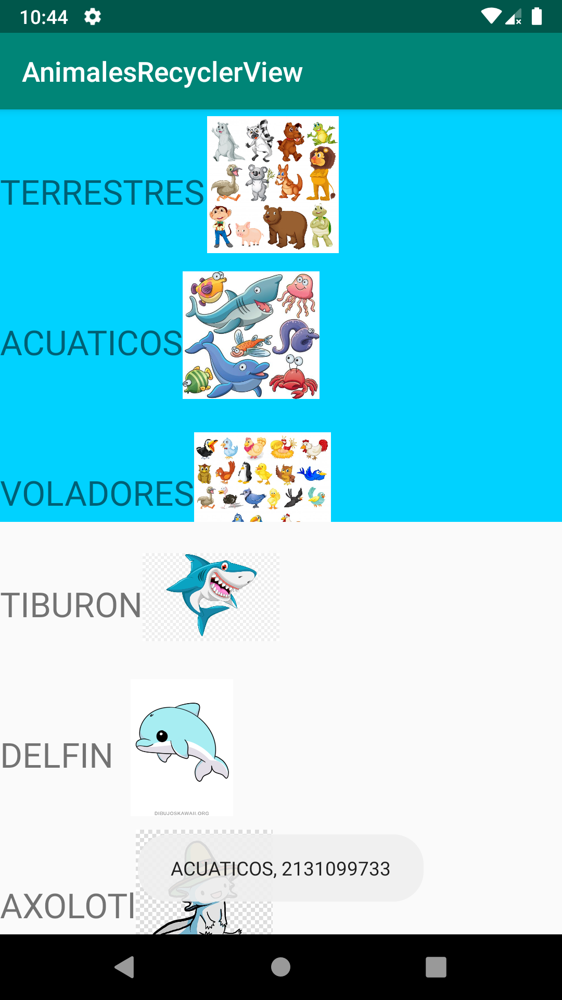
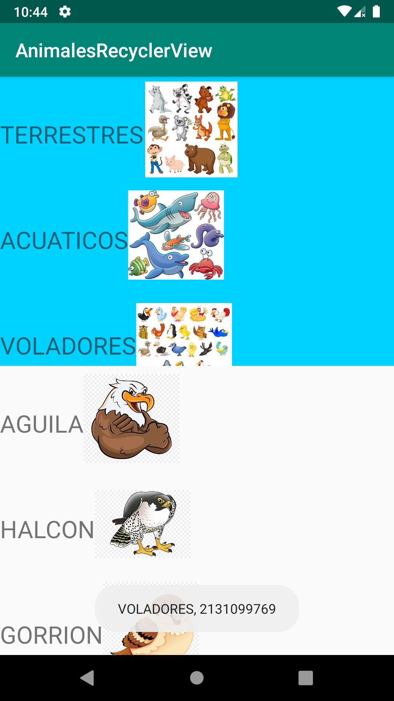

# Uso de RecyclerView, ScrollView y el uso CheckBox y RadioButtons
### Ejemplo del uso de RecyclerView

```kotlin
//ADAPTER
class MiAdaptador(var lista: ArrayList<datosAnimal>, val animal: Animal):RecyclerView.Adapter<MiAdaptador.miViewHolder>(){
    
    override fun onCreateViewHolder(parent: ViewGroup, viewType: Int): miViewHolder{
        var vista = LayoutInflater.from(parent.context).inflate(R.layout.item_categoria,parent,false)
        return miViewHolder(vista)
    }

    override fun getItemCount(): Int {
        return lista.size
    }

    override fun onBindViewHolder(holder: miViewHolder, position: Int) {
        var item = lista.get(position)
        holder.name.text = item.nombre
        holder.image.setImageResource(item.imagen)
        holder.image.setOnClickListener {
            animal.llenarAnimales(item)
            holder.imagen2.setImageResource(item.imagen)
        }
    }

    class miViewHolder(itemView: View):RecyclerView.ViewHolder(itemView) {
        val name = itemView.txtNombre
        val image = itemView.imagen
        val imagen2 = itemView.imagen2
    }
}
```







